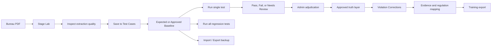
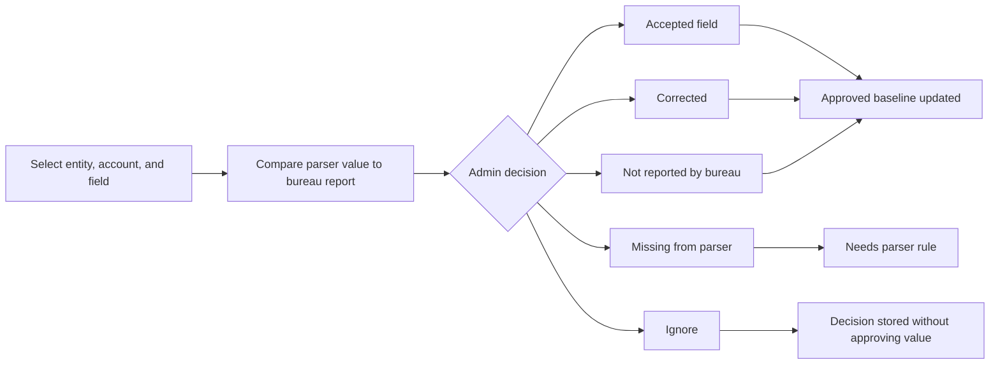
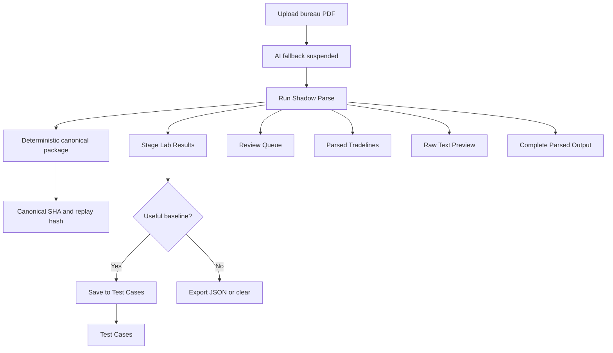
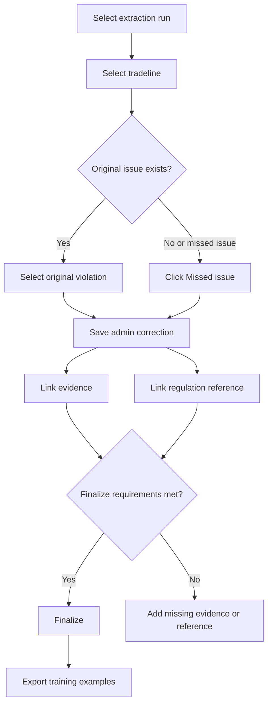
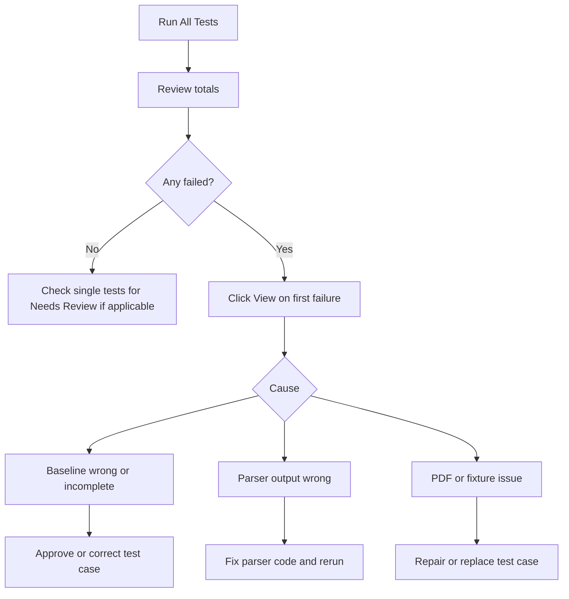
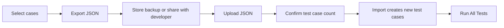

# Admin Parser Testing Environment Operations Manual

This manual explains how an admin should operate the Parser Testing Environment at `/admin-parser-testing`.
It covers every visible section and setting in the current staging UI:

- Test Cases
- Stage Lab
- Violation Corrections
- Run All Tests
- Import / Export

Use this environment to validate credit report PDF extraction, parser mapping, tradeline parsing, admin truth decisions, violation correction, regulation references, and regression safety before parser changes are promoted.

## 1. What This Environment Controls

The Parser Testing Environment is an admin-only quality control surface. It is not the normal user upload flow. Its purpose is to let admins create trusted parser baselines, compare future parser output against those baselines, correct parser and violation outcomes, and export training or backup data.

### Primary Operating Principle

Treat the parser as untrusted until a human admin confirms the result against the original bureau report. A passing test means the current parser matches the stored expected or approved baseline. It does not automatically mean the baseline itself is correct.

### Deterministic Operation Rule

Current parser testing, Stage Lab, Run All, and ingestion storage are deterministic-only for authoritative extraction. The canonical parser package is the shared object that carries `canonicalOutput`, deterministic field evidence, alternatives, history, and `replayHash` through parser tests and ingest storage.

Operationally this means:

- The same PDF bytes, source text, parser version, and active parser-rule set should produce the same normalized result and the same `replayHash`.
- Admin decisions do not silently overwrite parser output. They create approved truth and, where supported, parser-rule candidates that must pass deterministic validation before activation.
- Null, blank, or missing values should not replace non-null extracted values unless the admin decision or parser rule explicitly says the bureau did not report the field.
- AI, LLM, DocStrange, and OCR-assisted outputs are diagnostic only unless a deterministic rule validates and adopts the behavior later.

### Recommended Admin Flow

1. Use Stage Lab for exploratory parsing of a bureau PDF.
2. Review quality, source coverage, review queue items, raw text, canonical hashes, and complete mapped output.
3. Save a useful deterministic Stage Lab run to Test Cases.
4. In Test Cases, accept or correct parser output until the saved baseline represents bureau truth.
5. Run the single test to confirm the parser can reproduce that truth.
6. Use Violation Corrections to confirm, reject, correct, or add violation outcomes for the same source reports.
7. Run All Tests before and after parser changes.
8. Export test cases and training examples after meaningful admin review work.

## 2. Access, Scope, and Data Requirements

### Admin Access

Only admins can use this environment. Non-admin users should receive an access denied state when opening the page or related endpoints.

### Preferred URLs

| Environment | Browser URL | Purpose |
| --- | --- | --- |
| Staging | `https://staging.creditregulatorpro.com/admin-parser-testing` | Primary admin QA and staging verification |
| Local frontend | `http://localhost:5175/admin-parser-testing` | Local UI development and admin QA |
| Local backend | `http://localhost:3333` | API only; do not use this as the browser app URL |

### Required Test Data

Use PDF files that represent real bureau structures. Strong coverage needs:

| Data Type | Why It Matters |
| --- | --- |
| TransUnion Canada consumer disclosures | Validates TransUnion account blocks, dates, payment terms, narratives, and source text coverage |
| Equifax Canada credit reports | Validates Equifax account grouping, overview sections, balance fields, payment history rows, and dates |
| Known malformed PDFs | Confirms failed extraction is understandable and does not create false truth |
| Large PDFs | Confirms parser timing, file handling, and raw text retention under load |
| Reports with missing account numbers | Tests identity matching by creditor, account type, dates, and amounts |
| Reports with duplicated creditors | Tests tradeline matching and duplicate violation handling |
| Creditor statements and collection letters | Validates non-bureau layouts without mixing them into bureau-only expectations |
| Scanned or OCR-derived PDFs | Confirms text extraction failure is explicit; trust only deterministic text/OCR output |
| Exported portal PDFs | Validates generated PDF text order and semantic zone detection |
| Older and regional bureau layouts | Validates template/rule-pack coverage without fixed line-number assumptions |
| Known false positives | Trains violation rejection and irrelevant issue workflows |
| Known false negatives | Trains missed issue creation |

## 3. Key Terms

| Term | Meaning |
| --- | --- |
| Test case | A saved PDF plus expected or approved parser output used for regression testing |
| Stage Lab | A shadow parser run that lets admins inspect extraction without immediately changing test baselines |
| Expected value | Initial value stored for comparison, often created manually or from a saved Stage Lab output |
| Approved value | Admin-confirmed truth that supersedes expected values during parser test comparisons |
| Saved Parser Output | The stored parser output attached to a test case |
| Admin adjudication | Admin review action that accepts, corrects, marks missing, marks not reported, ignores, or approves output |
| Needs Review | The parser produced data that is not yet approved or the saved output still requires admin judgment |
| Stage version | The parser lab version that generated the Stage Lab output |
| Extraction source | The parser extraction path used to produce the output, such as `pdf_text` |
| Original SHA-256 | Hash of the uploaded PDF, used to link test case source documents to violation correction runs |
| Canonical SHA-256 | Hash of the normalized parser result, used to detect output changes |
| Replay hash | Stable hash of the deterministic replay package, used to prove the same inputs and active rules reproduce the same output |
| Canonical output | Shared normalized result object stored by parser tests and ingest storage; includes deterministic field objects, evidence, alternatives, and history |
| Candidate pool | All deterministic candidates considered for a canonical field before selection |
| Semantic zone | Structural area such as report header, consumer identity, tradeline accounts, inquiries, public records, or employment |
| Non-canonical diagnostic | LLM, DocStrange, or diagnostic-only candidate that can inform review but cannot become authoritative output by itself |
| Parser rule candidate | Admin-correction-derived rule proposal that must pass target validation and the regression gate before activation |
| Violation correction | Admin correction record for a machine-generated or manually added compliance issue |
| Evidence | A source quote, page, field, normalized value, and reason supporting a violation correction |
| Regulation mapping | Legal or internal authority linked to a correction |
| Training example | Exportable correction artifact used to improve future detection or parser behavior |

## 4. Section Map

```mermaid
flowchart TB
  Page["Parser Testing Environment"]
  Page --> TC["Test Cases"]
  Page --> SL["Stage Lab"]
  Page --> VC["Violation Corrections"]
  Page --> RAT["Run All Tests"]
  Page --> IE["Import / Export"]

  TC --> TC1["Create, edit, delete parser baselines"]
  TC --> TC2["Run one test case"]
  TC --> TC3["Approve fields and adjudicate saved output"]

  SL --> SL1["Upload PDF"]
  SL --> SL2["Run Shadow Parse"]
  SL --> SL3["Inspect quality and parsed output"]
  SL --> SL4["Save to Test Cases"]

  VC --> VC1["Review extraction runs"]
  VC --> VC2["Correct generated violations"]
  VC --> VC3["Add missed issues"]
  VC --> VC4["Link evidence and regulation references"]
  VC --> VC5["Finalize and export training"]

  RAT --> RAT1["Run entire parser regression suite"]
  RAT --> RAT2["Open failures for review"]

  IE --> IE1["Export selected test cases"]
  IE --> IE2["Import JSON test case bundles"]
```

## 5. Test Cases

### Relevance

Test Cases are the durable regression library. This is where a PDF becomes a repeatable parser test. Every parser change should be measured against these cases.

Use Test Cases when you need to:

- Create a new baseline from a PDF.
- Inspect saved parser output.
- Run one parser regression test.
- Approve or correct extracted consumer fields and tradelines.
- Convert admin-reviewed values into the truth layer.
- Delete obsolete cases while preserving training-marked artifacts.

### Test Cases Main Screen

| Control or Setting | What It Does | Admin Relevance |
| --- | --- | --- |
| `New Test Case` | Opens the test case editor | Creates a baseline from a PDF and expected values |
| Search box | Filters the test case list after a short debounce | Quickly finds reports by name or description |
| Test case row | Opens the selected test case detail panel | Lets admins inspect saved output and run history |
| Status badge: `New` | No prior run status exists | The case needs its first regression run |
| Status badge: `Pass` | Last run matched expectations or approved truth | Parser currently reproduces the baseline |
| Status badge: `Fail` | Last run did not match expectations or approved truth | Requires parser, baseline, or adjudication review |
| Status badge: `Review` | Latest in-session result passed but has unapproved data | The parser found additional data not covered by the baseline |
| Last Run | Timestamp of the most recent parser test run | Shows how fresh the regression result is |
| Run icon | Runs that single test case through the canonical parser using deterministic extraction while AI fallback is suspended | Fastest way to validate one baseline under the currently approved parser mode |
| Edit icon | Opens the editor for name, description, and expected values | Used for manual baseline maintenance |
| Delete icon | Deletes the test case and generated parser run output after confirmation | Removes obsolete cases; preserves training-marked artifacts before deletion |

### Create or Edit Test Case Dialog

| Field or Setting | Required | Meaning | Guidance |
| --- | --- | --- | --- |
| Test Case Name | Yes | Human-readable name for the baseline | Include bureau, consumer/report identifier, and report date if available |
| Description | No | Notes about the report, parser concern, or expected coverage | Record why this case exists and what failure it protects against |
| PDF upload | Yes for new case | Source bureau PDF converted to base64 and stored with the test case | Use a representative, authorized PDF. Existing cases do not require re-upload for normal edits |
| Consumer Info tab | No | Expected consumer identity and address fields | Set fields only when you want them tested or approved |
| Full Name | No | Expected consumer name | Prefer presence or exact approval depending on report stability |
| Date of Birth | No | Expected date in `YYYY-MM-DD` | Use the bureau-visible date only; do not infer |
| Address Line 1 | No | Expected street address | Useful for identity extraction regression |
| City | No | Expected city | Useful for address parsing regression |
| Province | No | Expected province | Usually exact because values should be standardized |
| Postal Code | No | Expected postal code | Usually format validated with Canadian postal code pattern |
| Tradelines tab | No | Expected account rows | Add one row per account that should be tested |
| Add Tradeline | No | Adds an expected tradeline row | Use for accounts that matter to parser coverage |
| Account Number | No | Expected account number if reported | If the bureau masks or omits account numbers, leave this flexible and rely on other identity fields |
| Creditor Name | No | Expected creditor or account section name | Helps tradeline identity matching |
| Balance | No | Expected balance | Numeric validation is usually less brittle than exact string validation |
| Status | No | Expected account status | Helps catch status mapping regressions |
| Save Test Case | Yes to persist | Creates or updates the test case | After saving, run the case or inspect Saved Parser Output |

### Saved Parser Output Detail

When a test case is selected and no new run result is currently open, the detail panel shows Saved Parser Output.

| Section | What It Shows | Why It Matters |
| --- | --- | --- |
| Context grid | Bureau, Parser Mode, AI Fallback, Stage Version, Extraction Source | Identifies how the saved output was generated |
| Metrics | Consumer Fields, Tradelines, Raw Text character count | Quick signal of extraction completeness |
| Admin Adjudication | Controls for accepting or correcting parser output | Converts raw saved output into approved downstream truth |
| Adjudication Decisions | Previously saved admin decisions | Audit trail for baseline corrections |
| Consumer Information | Saved or approved consumer info | Shows the baseline values currently being used |
| Saved Tradelines / Approved Tradelines | Saved or approved tradeline cards | Shows account-level parser output and admin-confirmed values |
| Raw Extracted Text | Stored raw source text | Lets admins verify fields against source text |

Parser context and parser-test run results may also include `canonicalOutput` and `replayHash`. These are developer-facing audit fields, not manual edit targets. If an admin sees a field disappear between Saved Parser Output, a single run, Run All, or ingest storage, treat that as a deterministic pipeline defect and preserve the source PDF, raw text, test case ID, and replay hash for developer review.

### Saved Parser Output Context Cards

| Card | Meaning | Admin Use |
| --- | --- | --- |
| Bureau | Bureau detected or stored for the test case | Confirms the parser routed the report correctly |
| Parser Mode | `Deterministic only`, `AI fallback suspended`, or mode not recorded | Shows whether a saved baseline previously relied on fallback assistance |
| AI Fallback | `Suspended`, `Suspended (saved allowed)`, or `Off` | Confirms fallback is currently unavailable even for older cases saved with it allowed |
| Stage Version | Stage Lab parser version that generated the saved output | Stale versions should be rerun before becoming trusted |
| Extraction Source | Source path such as PDF text | Helps diagnose differences between text extraction, HTML mapping, and fallback |

AI fallback is currently suspended globally pending controlled parser testing. The Run button still reads the parser parameters stored on the test case for audit context, but every parser test run executes with AI fallback disabled while the suspension flag is off.

### Admin Adjudication Settings in Test Cases

| Setting | Options or Input | Meaning | Admin Guidance |
| --- | --- | --- | --- |
| Entity | Report, Consumer Info, Tradeline, Inquiry, Employment, Public Record, Score, Other | Chooses the type of data under review | Start with Tradeline for account fields; use Report for bureau/stage metadata |
| Account / Section | Dynamic list based on the selected entity | Narrows the field list to one account or section | Choose the creditor/account being corrected |
| Field to Review | Dynamic field path list | Identifies the exact parser field | Verify the path before saving; field paths become part of the truth record |
| Decision | Corrected, Missing From Parser, Not Reported By Bureau, Accepted Field, Ignore | Records what the admin concluded | Use the most specific decision so future parser work is actionable |
| Corrected / Approved Value | Free text input | Value that should become approved truth, unless the decision is not reported | Enter exactly what the bureau report supports |
| Parser Extracted Value | Read-only preview | Current parser value for the selected field | `Blank / not parsed` means the selected field is empty, missing, or not extracted for that result |
| Current Approved Value | Read-only preview | Existing approved value for that field | If this says `No correction saved`, no approved truth exists yet |
| Source Evidence | Textarea | Quote or location from the original report | Include enough context for another admin to verify the decision |
| Reason / Parser Instruction | Textarea | Explains why the parser is wrong or how it should map the field | Use for parser fixes, such as "do not map Balloon Payment into Credit Limit" |
| Save Decision | Button | Persists the selected decision | Required before the decision becomes part of the test case history |
| Accept Saved Output | Button | Accepts the full saved parser output as approved truth | Use only after reviewing the saved output against the bureau report |

### Test Case Adjudication Decisions

| Decision | Use When | Effect |
| --- | --- | --- |
| Accepted Field | Parser value matches the bureau report | Marks the field as approved and partially reviewed |
| Corrected | Parser value exists but is wrong | Stores the corrected value and marks the case as needing a parser rule |
| Missing From Parser | Bureau report has the field but parser did not extract it | Stores the missing expected truth and marks parser work needed |
| Not Reported By Bureau | The field is not present on the bureau report | Stores an approved empty or null value where appropriate |
| Ignore | The field should not drive parser test truth | Keeps an audit note without turning it into a required baseline value |

### Parser Rule Promotion from Admin Decisions

Corrected and Missing From Parser decisions can show `Promote Rule`. This creates a deterministic parser-rule candidate from the admin decision and validates it before activation.

The promotion flow is:

1. Create a `parserRuleCandidate` from the decision, source evidence, parser instruction, bureau, field path, parsed value, and approved value.
2. Derive an explicit supported rule template when one exists.
3. Re-run the originating test case with the candidate rule.
4. Run the regression gate across all parser test cases unless disabled by the caller.
5. Activate the parser rule only if the originating case passes and no new regression failures are introduced.

Current automatic promotion is intentionally narrow. Supported examples include TransUnion tradeline `Legend` to `remarkCodes` and TransUnion missing account numbers normalized to a bureau-not-provided value. Unsupported corrections remain saved admin truth and a blocked candidate for developer review; they must not be treated as hidden parser behavior.

### Single Test Result Panel

After clicking Run for a single case, the detail panel shows Test Results.

| Result Area | Meaning | Admin Action |
| --- | --- | --- |
| `PASSED` | All configured expectations matched | No parser action required unless unapproved data exists elsewhere |
| `PASSED - Needs Review` | Configured expectations matched, but additional extracted data lacks approval | Review extracted fields and approve or ignore them |
| `FAILED` | One or more expectations failed | Inspect field differences, source text, and pattern suggestions |
| Run timestamp | Time of the test run | Confirms whether the result reflects current code |
| No expectations warning | The case has no expected values | Accept results or configure expectations before relying on it |
| Consumer Information Comparison | Field-level expected vs actual table | Approve correct values or fix incorrect baselines/parser behavior |
| Extracted Consumer Information | Actual consumer fields the parser found | Approve useful fields not yet in the baseline |
| Tradelines Comparison | Expected tradelines matched against actual tradelines | Finds account-level mismatches |
| Extracted Tradelines | All parsed tradelines from the current run | Approve complete tradelines or investigate missing/wrong accounts |
| Regex Pattern Suggestions | Suggested regexes for failed field extraction | Developer aid only; review before using in parser code |
| Accept All Results as Expected | Replaces expectations with current actual output | Use only when the current parser output is confirmed as bureau truth |

### Field Approval Dialog

The Field Approval Dialog controls how future test runs validate a field.

| Validation Mode | Meaning | Best Use |
| --- | --- | --- |
| Exact Match | Future runs must equal the current value exactly | Stable categorical fields, bureau names, statuses, account types, provinces |
| Presence Required | Future runs only need any non-empty value | Names, addresses, account numbers, and fields that can vary in formatting |
| Format Pattern | Future runs must match a regex pattern | Postal codes, masked account formats, structured identifiers |
| Numeric Range | Future runs must be numeric and optionally within min/max | Balances, limits, payments, high credit, past due |
| Skip Validation | Future runs do not validate this field | Noisy or non-critical fields |
| Add to known entities dictionary | Optional for creditor, status, and account type fields | Helps parser normalization recognize future recurring values |

### Test Case Delete Behavior

Deleting a test case removes:

- The test case row.
- Generated parser test run rows.
- Linked violation correction rows for artifacts tied to that test case source hash.
- Linked violation correction evidence, regulation references, and training rows attached to those corrections.

Before deletion, training-marked artifacts are preserved into the parser test training archive. The UI toast reports counts for deleted test runs, deleted corrections, and preserved training artifacts.

### Test Cases Best Practices

| Practice | Reason |
| --- | --- |
| Name cases by bureau, report, and scenario | Makes failures faster to triage |
| Prefer Stage Lab save for complex PDFs | Captures parser context, hashes, quality metrics, and raw text |
| Do not use Accept All blindly | It can turn parser errors into the approved baseline |
| Use evidence and reasons when correcting | Future admins and developers need audit context |
| Promote only source-backed corrections | Parser-rule candidates should come from clear report evidence and an explicit parser instruction |
| Preserve replay details for anomalies | `replayHash`, original SHA, raw text, and test case ID make parser drops reproducible |
| Keep exact matching for stable fields only | Reduces brittle regressions from harmless formatting changes |
| Run a single test after each baseline edit | Confirms the edited baseline behaves as intended |

## 6. Stage Lab

### Relevance

Stage Lab is the safest first stop for a new PDF. It runs the deterministic shadow parser and displays extraction quality, review items, parsed tradelines, raw text, and complete mapped output. It does not become a regression baseline unless an admin saves it to Test Cases.

Use Stage Lab when you need to:

- Evaluate a new bureau PDF.
- Compare deterministic extraction while AI fallback is suspended.
- Inspect source-backed tradelines and quality gates.
- Capture parser context and hashes.
- Create a new test case from a verified parser run.

### Stage Lab Operating Flow

### Stage Lab Control Panel

| Control or Setting | What It Does | Admin Relevance |
| --- | --- | --- |
| Upload bureau PDF | Accepts a PDF file through the file dropzone | Starts a shadow parse from a source report |
| Selected file display | Shows the chosen file name | Confirms the correct report was selected |
| Clear | Removes the selected file and current result | Prevents saving or inspecting the wrong result |
| AI fallback switch | Disabled while AI fallback is suspended | Confirms Stage Lab cannot invoke fallback output until it is tested |
| Run Shadow Parse | Runs the Stage Lab parser for the selected PDF | Produces quality, retention, parsed, raw, deterministic pipeline, and audit output |
| Export JSON | Downloads the complete Stage Lab result | Useful for debugging, including `audit.deterministicPipeline`, canonical hashes, and `replayHash` |
| Save to Test Cases | Saves the Stage Lab result and original PDF as a test case | Creates a durable regression baseline with parser context, `canonicalOutput`, and `replayHash` when available |
| Saved to Test Cases | Disabled state after successful save | Prevents accidental duplicate saves from the same result |

### AI Fallback Setting

| State | Meaning | Recommended Use |
| --- | --- | --- |
| On | Temporarily unavailable while fallback is suspended | Do not use until fallback has its own controlled regression suite |
| Off | Deterministic extraction only | Current enforced behavior for Stage Lab, parser tests, and ingestion |

When a Stage Lab result is saved to Test Cases, the test case stores `parserMode` and `allowAiFallback`. While fallback is suspended, new Stage Lab cases save as deterministic-only. Older fallback-assisted baselines should be treated as historical records until fallback testing is restored.

DocStrange, LLM, and AI-assisted values can be useful diagnostics, but they are not authoritative parser output in this environment. Do not accept a value only because a diagnostic path suggested it; accept or correct it only after verifying the source PDF and, where possible, promoting an explicit deterministic rule.

### Stage Lab Result Tabs

| Tab | Contents | Relevance |
| --- | --- | --- |
| Stage Lab Results | Run summary, quality score, retention metrics, counts, blockers, issues | First view for deciding whether the parse is usable |
| Review Queue | Report-level and tradeline-level items needing manual parser review | Directs admin attention to risky fields |
| Parsed Tradelines | Account cards with financial snapshot, detailed fields, payment rows, review reasons | Best view for validating account parsing |
| Raw Text Preview | Extracted source text preview | Confirms whether the PDF text layer contains the target values |
| Complete Parsed Output | Full parsed result and canonical mapped output | Deep audit view for developers and advanced admins |

### Stage Lab Results Tab

| Field or Metric | Meaning | Admin Interpretation |
| --- | --- | --- |
| Stage version | Current Stage Lab parser version | If the result becomes stale, rerun before saving |
| Confidence score | Overall quality score from 0 to 100 | Higher is better, but still requires human review |
| Bureau | Detected bureau name | If wrong, parser routing needs review |
| Source | Extraction source used | Helps diagnose extraction path issues |
| Side effects | Should be `none` | Stage Lab should not mutate user workflows |
| Critical fields | Percent completeness for important fields | Low values mean the result needs review before baseline use |
| Source coverage | Percent of tradelines backed by source text | Low source coverage weakens evidence confidence |
| Review queue | Count of items flagged for manual review | Non-zero requires admin inspection |
| Raw text chars | Number of raw text characters extracted | Very low counts suggest OCR/text extraction failure |
| Original SHA-256 | Hash of uploaded PDF | Links the test case source to correction runs |
| Canonical SHA-256 | Hash of normalized result | Detects parser output changes |
| Replay hash | Stable hash in the run payload and export JSON | Same PDF, source text, parser version, and active rules should reproduce this value |
| Source-backed tradelines | Tradelines with source text over total tradelines | Confirms whether accounts can be traced back to raw text |
| Extracted counts | Counts of tradelines, inquiries, employment records, scores, and related sections | Validates report completeness |
| Quality Gates | Blockers and issues with severity | Must be reviewed before saving as a trusted baseline |

### Review Queue Tab

| Element | Meaning | Admin Use |
| --- | --- | --- |
| Queue count badge | Number of review items | Zero means no Stage Lab review items were generated |
| Report-level item | Whole-report issue | Check bureau detection, report metadata, or raw extraction |
| Tradeline item | Account-specific issue | Inspect the account fields and source text |
| Reason badges | Why the item was flagged | Directs what field or rule needs review |
| Financial snapshot | Balance, payment, frequency, past due, high credit, credit limit | Quick account sanity check |
| Source evidence preview | Field grid and payment history rows | Helps verify whether the parser output is source-backed |

### Parsed Tradelines Tab

| Element | Meaning | Admin Use |
| --- | --- | --- |
| Tradeline count badge | Number of parsed tradelines | Compare with the report's visible account count |
| Source-backed / Needs review badge | Whether the account has source support or review reasons | Prioritize `Needs review` accounts |
| Financial snapshot | Core financial fields | Catch balance, payment, limit, and past due mapping errors |
| Field grid | Full account-level extracted fields | Verify dates, status, account type, responsibility, MOP, terms, and payment profile |
| Payment history rows | Parsed month/payment rows | Check date and amount alignment |
| Review reasons | Reasons attached to that account | Useful for parser defect tickets |

### Raw Text Preview Tab

Use this tab to verify whether a missing field was present in the text extraction layer. If the source text does not contain the field, parser rules may not be able to extract it without deterministic OCR or an alternate extraction path. If the source text does contain the value, the parser rule or mapping likely needs work.

For scanned image-only PDFs, do not treat an AI/OCR guess as canonical parser truth. Record the gap, preserve the PDF and Stage Lab export, and add deterministic OCR/template work before relying on that layout in regression testing.

### Complete Parsed Output Tab

This tab is for detailed audit and developer handoff.

| Subsection | Meaning |
| --- | --- |
| Parsed Result: Report Metadata | Bureau/report identifiers and metadata extracted before canonical mapping |
| Parsed Result: Consumer Info | Consumer identity and address fields before mapping |
| Parsed Result: Tradelines | Account rows before canonical mapping |
| Parsed Result: Payment Histories | Payment detail rows before mapping |
| Parsed Result: Inquiries | Inquiry rows before mapping |
| Parsed Result: Public Records | Public record rows before mapping |
| Parsed Result: Employment Info | Employment rows before mapping |
| Parsed Result: Credit Scores | Score rows before mapping |
| Parsed Result: Consumer Statements | Statement rows before mapping |
| Canonical Mapped Output: Mapped Report Fields | Normalized report-level fields used downstream |
| Canonical Mapped Output: Mapped Tradelines | Normalized account records used downstream |
| Canonical Mapped Output: Mapped Inquiries | Normalized inquiry records |
| Canonical Mapped Output: Mapped Credit Related Inquiries | Normalized credit inquiry subset |
| Canonical Mapped Output: Mapped Non-Credit Related Inquiries | Normalized non-credit inquiry subset |
| Canonical Mapped Output: Mapped Public Records | Normalized public record rows |
| Canonical Mapped Output: Mapped Employments | Normalized employment rows |
| Canonical Mapped Output: Mapped Scores | Normalized score rows |

The Stage Lab export also includes `audit.deterministicPipeline`. Use that object for developer handoff when the question is why one canonical field won, why an alternative was rejected, which semantic zone supplied evidence, or whether an LLM/DocStrange diagnostic was correctly blocked from canonical output.

### Stale Stage Lab Result

If the page says the parser result needs rerun, the result was generated by an older Stage Lab version. Clear the stale result, rerun the PDF, and inspect the new output before saving.

## 7. Violation Corrections

### Relevance

Violation Corrections turn machine-generated compliance findings into admin-reviewed truth. This section is also where admins add missed issues, attach evidence, map regulation references, finalize corrections, and export training examples.

Within the Parser Testing Environment, Violation Corrections are scoped to source documents from active parser test cases when source hashes are available. If there are no active parser test case sources, the panel shows `No active parser test case sources`.

Violation search compatibility must be preserved during parser normalization work. Admin corrections should not rename violation IDs, violation types, regulation references, evidence-link fields, review status fields, or existing search assumptions. New deterministic violation details must still map back to the current violation search model and include source evidence that can be searched by consumer/report, tradeline, creditor, collection agency, regulation reference, review status, and date where applicable.

### Violation Correction Flow

### Top Toolbar

| Control or Setting | Options | Meaning | Admin Guidance |
| --- | --- | --- | --- |
| Review status filter | Needs review, Finalized, All runs | Filters extraction runs by correction state | Start with Needs review for active work; use Finalized for audits |
| Runs badge | Number | Shows how many runs match the filter | If zero, confirm a parser test source report has created extraction/violation data |
| Export training | Button | Downloads training examples marked for training | Export after meaningful finalized corrections or training notes |

### Extraction Runs Column

| Display Field | Meaning | Admin Use |
| --- | --- | --- |
| Run number | Extraction run ID | Selects the run to review |
| Artifact number | Source report artifact ID | Helps trace the source PDF |
| Date | Completed or created date | Confirms recency |
| Tradeline count | Number of accounts in the run | Confirms expected report scope |
| Issue count | Number of machine-generated violation findings | Determines review load |
| Final count | Number of finalized corrections | Tracks completion |

### Tradelines Column

| Display Field | Meaning | Admin Use |
| --- | --- | --- |
| Creditor name | Account creditor or section label | Select the account under review |
| Bureau and account number | Bureau context and account identifier | Prevents reviewing the wrong account |
| Original count | Number of original machine issues | Indicates detection output |
| Added count | Number of manually added corrections | Indicates false-negative review activity |

### Original Extraction Column

| Element | Meaning | Admin Use |
| --- | --- | --- |
| Account snapshot | Creditor, bureau, account number, status, balance | Confirms account context before correcting |
| Missed issue | Starts manual correction mode | Use for false negatives where the machine missed a violation |
| Original violation card | Machine-generated violation category and summary | Select to confirm, correct, reject, or classify |
| Confidence | Machine confidence score | Helps prioritize human review |
| Correction count | Existing corrections for that issue | Shows whether the item was already reviewed |

### Admin Correction Settings

| Setting | Options or Input | Meaning | Required for Good Review |
| --- | --- | --- | --- |
| Action | Confirmed, Corrected, Rejected, Irrelevant, Duplicate, Insufficient Evidence | Admin's judgment on the selected or manually added issue | Yes |
| Type | Free text | Correct violation category/type | Required when confirming, correcting, or adding an issue |
| Severity | INFO, WARNING, ERROR, LOW, MEDIUM, HIGH, CRITICAL | Correct severity level | Recommended for all corrections |
| Confidence | 0 to 100 | Admin-corrected confidence score | Recommended when correcting machine confidence |
| Summary | Textarea | User-facing or admin-facing issue summary | Recommended for finalized truth |
| Explanation | Textarea | Detailed explanation or recommended action | Recommended for actionable findings |
| Correction Reason | Textarea | Why the admin changed or confirmed the issue | Strongly recommended |
| Reviewer Notes | Textarea | Internal review notes | Use for context not suitable for user output |
| Training Label | False Positive, False Negative, Misclassified, Weak Evidence, Irrelevant, Confirmed Good | Classification used for training export | Yes if `Use for training` is enabled |
| Use for training | Checkbox | Includes correction in training export | Enable for useful learning examples |
| Training note only | Checkbox | Treats correction as a training/audit note rather than a finalized evidence-backed issue | Use when documenting parser/detector behavior without requiring evidence and regulation |
| Save correction | Button | Creates or updates the correction | Must be clicked before evidence or regulation references can be linked |
| Finalize | Button | Marks correction finalized when requirements are met | Use after the correction, evidence, and regulation mapping are complete |
| Status badge | Unsaved, in review, finalized | Shows current persistence/review state | Do not assume changes are saved until status and toast confirm |

### Correction Actions

| Action | Use When | Downstream Meaning |
| --- | --- | --- |
| Confirmed | The machine-generated issue is correct | Reinforces detector behavior |
| Corrected | The issue exists, but type, severity, summary, explanation, or confidence is wrong | Creates corrected truth and training signal |
| Rejected | The machine-generated issue is wrong | Records a false positive |
| Irrelevant | The issue may exist but should not matter for this workflow | Keeps it from becoming actionable truth |
| Duplicate | Another issue already covers the same concern | Prevents duplicated downstream output |
| Insufficient Evidence | The issue may be plausible but lacks enough source support | Blocks unsupported conclusions |

### Training Labels

| Label | Use When |
| --- | --- |
| False Positive | Machine created an issue that should not exist |
| False Negative | Admin manually adds an issue the machine missed |
| Misclassified | Machine found an issue but assigned the wrong category/type |
| Weak Evidence | Machine finding is not adequately supported by source evidence |
| Irrelevant | Finding should not be used as actionable compliance output |
| Confirmed Good | Machine finding is correct and useful |

### Evidence Settings

| Setting | Meaning | Admin Guidance |
| --- | --- | --- |
| Linked count | Number of evidence records attached to the active correction | At least one is required before finalizing unless training note only is checked |
| Page | Source PDF page number | Use the visible page where the supporting text appears |
| Field | Field name or report location | Examples: `status`, `balance`, `lastReportedDate`, `sourceText` |
| Excerpt | Quote from the report | Required; include enough text to support the correction |
| Normalized Value | Clean value used by the system | Useful for dates, balances, statuses, and account numbers |
| Reason | Why this excerpt supports the correction | Required; make it clear and specific |
| Link evidence | Saves evidence to the active correction | Correction must be saved first |
| Remove evidence | Deletes the linked evidence row | Use if the wrong page, field, or quote was linked |

### Regulation Mapping Settings

| Setting | Options or Input | Meaning | Admin Guidance |
| --- | --- | --- | --- |
| Active count | Number of active regulation references | Active references can satisfy finalize requirements |
| Suggested references | Buttons from machine suggestions | Use only after confirming the citation fits the issue |
| Jurisdiction | Federal, Provincial, Bureau Standard, Internal Rule | Scope of the authority | Select the narrowest correct scope |
| Province | Free text | Province or territory if applicable | Required conceptually for provincial references |
| Body | Free text | Regulator or standard body | Examples: federal regulator, bureau standard, internal policy body |
| Regulation | Free text | Regulation or authority name | Use the official name where possible |
| Statute or Rule | Free text | Specific statute, rule, or standard | Required for traceability |
| Section | Free text | Section number | Required for traceability |
| Subsection | Free text | Subsection number | Use when relevant |
| Citation Source | Free text | Where the citation came from | Defaults to `Admin review` |
| Citation URL | URL | Optional source link | Must be valid if provided |
| Confidence | 0 to 1 | Confidence in the citation mapping | Use lower values when unverified |
| Excerpt | Textarea | Relevant regulation text | Required for a linked reference |
| Verified | Checkbox | Admin has verified the citation | Use only after checking the source |
| Link reference | Saves the reference to the active correction | Correction must be saved first |
| Mark incorrect / active | Toggles mapping status | Use instead of deleting when you need audit history of bad mappings |
| Verify / unverify | Toggles admin verification | Keeps citation verification state current |
| Remove reference | Deletes the linked reference | Use for accidental or irrelevant references |

### Finalize Requirements

The Finalize button is enabled only when:

1. The correction has been saved.
2. Either at least one evidence record is linked or `Training note only` is checked.
3. Either `Training note only` is checked, or the action is Rejected, Irrelevant, Duplicate, Insufficient Evidence, or at least one active regulation reference is linked.

This means a confirmed or corrected actionable violation normally needs both source evidence and an active regulation reference before finalization.

Do not invent a violation, citation, or evidence excerpt to satisfy finalization. If the factual trigger is unclear, use Rejected, Irrelevant, Duplicate, Insufficient Evidence, or Training note only as appropriate and keep the correction available for future deterministic rule work.

### Recommended Violation Correction Procedures

#### Confirm a Correct Machine Violation

1. Select the run, tradeline, and original violation.
2. Set Action to Confirmed.
3. Verify Type, Severity, Confidence, Summary, and Explanation.
4. Add Correction Reason and Reviewer Notes.
5. Keep Training Label as Confirmed Good if it should train future behavior.
6. Save correction.
7. Link evidence.
8. Link or verify regulation reference.
9. Finalize.

#### Reject a False Positive

1. Select the original violation.
2. Set Action to Rejected.
3. Set Training Label to False Positive.
4. Explain why the issue is wrong in Correction Reason.
5. Add reviewer notes if needed.
6. Save correction.
7. Link evidence if useful, or mark Training note only for detector feedback.
8. Finalize when requirements are met.

#### Add a Missed Issue

1. Select the affected tradeline.
2. Click Missed issue.
3. Set Action to Corrected.
4. Enter Type, Severity, Confidence, Summary, and Explanation.
5. Set Training Label to False Negative.
6. Save correction.
7. Link evidence from the source report.
8. Link regulation reference.
9. Finalize.

## 8. Run All Tests

### Relevance

Run All Tests is the regression gate. It runs every parser test case through the same canonical deterministic parser path used by single test runs while AI fallback is suspended, compares results to expected or approved truth, stores each run result, and reports pass/fail totals.

Use Run All Tests:

- Before merging parser changes.
- After changing extraction, mapping, date handling, tradeline identity, or parser validation logic.
- After activating parser rules from admin corrections.
- After importing test cases.
- After large admin baseline updates.
- Before staging signoff.

### Run All Controls and Output

| Control or Output | Meaning | Admin Action |
| --- | --- | --- |
| Run All Tests | Starts sequential regression execution across every test case with AI fallback disabled while suspended | Click when ready to validate full parser behavior |
| Total | Number of test cases executed | Confirms the expected suite size |
| Passed | Count of cases that matched baselines | Should stay stable or increase after fixes |
| Failed | Count of cases that failed | Must be triaged before parser release |
| Failures list | Failed case name and reason | Use to identify what broke |
| View | Opens the failed case in Test Cases | Inspect details, rerun, and adjudicate |

Each stored run result can carry the same `canonicalOutput` and `replayHash` contract as single test runs and ingest storage. When investigating a regression, compare expected/approved values first, then use raw text, parser context, canonical hashes, and replay hash to determine whether the parser changed, the baseline changed, or the source document fixture changed.

### Failure Reasons

| Failure Reason | Meaning | First Triage Step |
| --- | --- | --- |
| No Expected Values Configured | The test case has no usable expectations or approved truth | Open case, accept or configure baseline |
| Consumer Info Mismatch | A consumer field did not match the baseline | Compare field result and source text |
| Tradeline Mismatch | An account or account field did not match the baseline | Inspect identity matching, account fields, and parsed tradelines |
| Exception | The parser threw an error during that case | Review server logs and source PDF validity |

### Run All Interpretation

## 9. Import / Export

### Relevance

Import / Export protects the parser regression library and lets admins move test cases between environments or hand them to developers.

### Export Test Cases

| Control or Setting | Meaning | Admin Guidance |
| --- | --- | --- |
| Select All | Selects every listed test case | Use for full backup before major parser work |
| Individual checkbox | Selects one test case for export | Use for focused sharing or reproduction |
| Export Selected count | Number of selected cases | Confirm before downloading |
| Export Selected button | Downloads selected cases as JSON | Filename is generated by the page with the current date |

The exported JSON includes:

- Name and description.
- PDF base64.
- Expected consumer info and tradelines.
- Raw extracted text.
- Bureau, parser mode, AI fallback suspension state, stage version, extraction source.
- Parser context, including `canonicalOutput` and `replayHash` when available.
- Admin review status.
- Approved consumer info and tradelines.
- Adjudication decisions.

The export does not include parser test run history. Violation correction rows are not part of the parser test case export, although test case adjudication decisions are included.

### Import Test Cases

| Control or Setting | Meaning | Admin Guidance |
| --- | --- | --- |
| Upload JSON File | Selects a previously exported parser test case bundle | Use only files from trusted parser testing exports |
| File name display | Shows selected JSON file | Confirm the correct bundle |
| Change | Clears the selected import file | Use before importing if the wrong file was selected |
| Preview count | Shows how many test cases the JSON contains | Confirm expected count before import |
| Import Test Cases | Creates new test case rows from the JSON | Imports add rows; they do not update or deduplicate existing cases |

### Import / Export Flow

### Import / Export Best Practices

| Practice | Reason |
| --- | --- |
| Export before deleting or bulk editing cases | Gives rollback data |
| Export after major adjudication work | Preserves admin-reviewed truth |
| Export after parser-rule promotion | Preserves the source decisions and replay context for activated or blocked candidates |
| Run All Tests after import | Confirms imported cases are executable in the target environment |
| Watch for duplicates | Import creates new rows and does not merge with existing names |
| Protect exported JSON | It includes PDF contents as base64 and may contain sensitive report data |

## 10. First-Time Admin Quick Start

Use this checklist for the first parser testing session.

1. Open `/admin-parser-testing`.
2. Go to Stage Lab.
3. Upload a known TransUnion or Equifax PDF.
4. Confirm AI fallback is suspended and unavailable.
5. Click Run Shadow Parse.
6. Review Stage Lab Results for confidence, review queue count, source coverage, blockers, canonical hashes, and extracted counts.
7. Open Parsed Tradelines and verify at least one account against the PDF.
8. Open Raw Text Preview if fields look missing.
9. Export JSON or open Complete Parsed Output if canonical mapping, candidate selection, or replay behavior needs developer review.
10. If the result is useful, click Save to Test Cases.
11. Go to Test Cases and open the saved case.
12. Review Saved Parser Output.
13. Use Accept Saved Output only if the saved parser output matches the bureau report.
14. Otherwise, use Admin Adjudication to correct fields one at a time with source evidence.
15. Use Promote Rule only for source-backed Corrected or Missing From Parser decisions that should become future deterministic behavior.
16. Click Run for the test case.
17. Resolve Failed or Needs Review items.
18. Go to Violation Corrections and review linked runs for that source report.
19. Confirm, correct, reject, or add violation outcomes.
20. Link evidence and regulation references.
21. Finalize completed corrections.
22. Go to Run All Tests and run the full suite.
23. Export test cases and training examples after successful review.

## 11. Operational Recipes

### Turn a New PDF Into a Regression Test

1. Stage Lab: upload PDF and run shadow parse.
2. Review quality gates, review queue, parsed tradelines, raw text, canonical SHA, and replay hash.
3. Save to Test Cases.
4. Test Cases: open the new case.
5. Accept saved output if fully correct, or correct individual fields with adjudication.
6. Run the single test.
7. Resolve Failed or Needs Review.
8. Run All Tests.
9. Export the updated test suite.

### Investigate `Blank / not parsed`

1. Confirm the selected Entity, Account / Section, and Field to Review are correct.
2. Check Raw Extracted Text for the value.
3. If the value is present in raw text, save a Missing From Parser or Corrected decision with source evidence.
4. If the value is absent from raw text, treat it as extraction/OCR/source issue rather than a mapping-only issue.
5. Add Reason / Parser Instruction explaining the expected parser behavior.
6. Rerun the test after parser changes.

### Fix a Wrong Date, Balance, or Status in a Baseline

1. Open the test case.
2. Select the field in Admin Adjudication.
3. Compare the parser value to the bureau PDF.
4. Choose Corrected if the parser is wrong.
5. Enter the exact bureau-supported value.
6. Add Source Evidence and Reason.
7. Save Decision.
8. Promote Rule if the correction matches a supported deterministic template and should apply to future documents.
9. Run the single test.
10. If the test now fails because the parser still emits the old value, create a parser fix and rerun.

### Review a False Positive Violation

1. Go to Violation Corrections.
2. Filter Needs review.
3. Select the run, tradeline, and original violation.
4. Set Action to Rejected.
5. Set Training Label to False Positive.
6. Explain why in Correction Reason.
7. Save correction.
8. Add evidence or mark Training note only as appropriate.
9. Finalize.
10. Export training examples after the review batch.

### Add a False Negative Violation

1. Go to Violation Corrections.
2. Select the run and tradeline.
3. Click Missed issue.
4. Fill Type, Severity, Confidence, Summary, and Explanation.
5. Set Training Label to False Negative.
6. Save correction.
7. Link source evidence.
8. Link regulation reference.
9. Finalize.

### Staging Parser Release Gate

1. Import or create any new test cases needed for the change.
2. Run single tests for changed scenarios.
3. Resolve Failed and Needs Review results.
4. Promote or document admin correction rules needed by the change.
5. Review violation corrections for affected reports.
6. Confirm violation search behavior still works for affected violation types, regulation references, tradelines, creditors, collection agencies, evidence links, review statuses, and dates.
7. Run All Tests.
8. Confirm zero unexpected failures.
9. Export updated test cases and training examples.
10. Record any accepted blocked or known-failing cases separately before promotion.

## 12. Common States and Messages

| Message or State | Meaning | What To Do |
| --- | --- | --- |
| No saved parser output is attached | Test case has no stored parser output/raw text | Run the case or recreate from Stage Lab |
| No expected values configured | Test has no baseline to compare against | Accept verified output or add expectations |
| Passed - Needs Review | Existing expectations passed, but new/unapproved data exists | Approve, skip, or adjudicate additional fields |
| Blank / not parsed | Selected parser field is empty or missing | Verify source text and save a correction if bureau reports it |
| No correction saved | No approved value exists for the selected field | Save a decision to create approved truth |
| No active parser test case sources | Violation Corrections has no source hashes from active test cases | Save Stage Lab output to Test Cases or verify parser context source hashes |
| No runs | No extraction runs match the filter | Change filter or create/run source reports |
| Save the correction before linking evidence | Evidence requires a persisted correction ID | Click Save correction first |
| Save the correction before linking a reference | Regulation references require a persisted correction ID | Click Save correction first |
| Parser rule candidate blocked | The correction does not match a supported automatic rule template | Keep the decision as admin truth and send the candidate details to developers |
| Parser rule candidate failed validation | The candidate did not make the originating test pass or introduced new regression failures | Do not activate it; inspect source evidence, rule scope, and Run All failures |
| Replay hash changed unexpectedly | Same source fixture produced a different deterministic package | Compare active parser rules, stage version, raw text, canonical output, and source PDF hash |
| Parser result needs rerun | Stage Lab result was created by an older stage version | Clear stale result and rerun |
| Import preview shows zero cases | JSON does not contain a valid `testCases` array | Use a valid parser test export |

## 13. Quality Standards for Admin Review

### Good Test Case

A high-quality test case has:

- Clear name and description.
- Original PDF attached.
- Bureau and parser context recorded.
- Canonical output and replay hash retained when available.
- Raw extracted text retained when available.
- Expected or approved consumer fields.
- Representative tradelines.
- Admin decisions for corrected or missing fields.
- A recent passing single test.

### Good Parser Field Correction

A high-quality field correction has:

- Correct entity and field path.
- Correct account or section selected.
- Clear decision type.
- Corrected value copied from the bureau report.
- Source evidence with report location or quote.
- Parser instruction explaining the expected behavior.
- Parser-rule promotion attempted only when the correction should become explicit future behavior.

### Good Violation Correction

A high-quality violation correction has:

- Correct action and training label.
- Corrected type, severity, confidence, summary, and explanation when applicable.
- Correction reason that explains the admin judgment.
- Linked evidence unless it is training-note-only.
- Active regulation reference for actionable confirmed/corrected findings.
- Existing violation type, regulation reference, evidence link, and status semantics preserved for search.
- Finalized status after review is complete.

### Good Regulation Mapping

A high-quality regulation mapping has:

- Correct jurisdiction.
- Official body and regulation name.
- Specific statute or rule.
- Section and subsection when available.
- Regulation text excerpt.
- Citation source and URL when available.
- Verified checked only after admin validation.

## 14. Endpoint and Data Function Map

This map is for admins coordinating with developers. It shows what UI actions call behind the scenes.

| UI Function | Endpoint or Hook | Purpose |
| --- | --- | --- |
| List test cases | `/_api/parser-test-case/list` | Loads Test Cases table |
| Create test case | `/_api/parser-test-case/create` | Saves PDF and baseline fields |
| Update test case | `/_api/parser-test-case/update` | Updates name, description, expected fields, and tradelines |
| Delete test case | `/_api/parser-test-case/delete` | Deletes test case and linked generated outputs while archiving training-marked artifacts |
| Run one test | `/_api/parser-test-case/run` | Runs one PDF through production parser, stores canonical output/replay hash when available, and compares against baseline |
| Run all tests | `/_api/parser-test-case/run-all` | Runs all parser test cases sequentially and stores canonical output/replay hash per run when available |
| Export test cases | `/_api/parser-test-case/export` | Downloads selected parser test case JSON |
| Import test cases | `/_api/parser-test-case/import` | Creates test cases from exported JSON |
| Adjudicate parser output | `/_api/parser-test-case/adjudicate` | Saves approved values and field decisions |
| Promote parser rule | `/_api/parser-test-case/promote-rule` | Creates a parser-rule candidate from an admin decision and activates it only after deterministic validation |
| Stage Lab run | `/_api/parser-lab/run` | Runs shadow parser and returns quality, retention, replay hash, raw, parsed, deterministic pipeline, and audit output |
| Violation correction runs | `/_api/admin/violation-correction/runs` | Lists extraction runs for correction review |
| Violation correction detail | `/_api/admin/violation-correction/detail` | Loads tradelines, violations, corrections, evidence, and references for a run |
| Create correction | `/_api/admin/violation-correction/create` | Creates admin correction record |
| Update correction | `/_api/admin/violation-correction/update` | Updates correction record |
| Link evidence | `/_api/admin/violation-correction/evidence` | Adds or removes evidence |
| Link regulation reference | `/_api/admin/violation-correction/regulation-reference` | Adds, updates, marks incorrect, verifies, or removes regulation references |
| Finalize correction | `/_api/admin/violation-correction/finalize` | Marks correction finalized |
| Export violation training | `/_api/admin/violation-correction/export` | Downloads training examples |

## 15. Admin Completion Checklist

Use this checklist before considering parser testing work complete.

| Check | Required Outcome |
| --- | --- |
| Stage Lab run inspected | Quality, retention, review queue, tradelines, raw text, and audit output reviewed |
| Test case saved | Useful Stage Lab output or manual test case saved |
| Baseline approved | Expected or approved truth matches the bureau report |
| Single test run | Target case passes or has documented expected failure |
| Needs Review resolved | Additional extracted data approved, skipped, or adjudicated |
| Parser-rule candidates handled | Supported correction rules promoted or blocked candidates documented for developer review |
| Replay context preserved | Original SHA, canonical SHA, replay hash, raw text, and export JSON available for anomalies |
| Violation corrections reviewed | Relevant machine issues confirmed, corrected, rejected, or classified |
| Missed issues added | Known false negatives are manually added |
| Evidence linked | Evidence exists for finalized actionable corrections |
| Regulation mapped | Active references exist for actionable confirmed/corrected violations |
| Training examples exported | Training-relevant corrections are exported |
| Run All Tests completed | Full suite run reviewed and failures triaged |
| Violation search spot-check completed | Search behavior verified for affected violation categories, references, entities, evidence, status, and date filters |
| Test cases exported | Updated regression library backed up |

## 16. Troubleshooting Guide

| Problem | Likely Cause | Resolution |
| --- | --- | --- |
| Run All has many `No Expected Values Configured` failures | Test cases were created without approved or expected fields | Open each case, accept verified output, or configure expectations |
| A date appears shifted | Date formatting/parsing issue or stale parser output | Rerun current parser; compare source text; save corrected decision if needed |
| Corrected parser field does not save | Missing field path, unsaved state, or endpoint error | Confirm field is selected, click Save Decision, watch for toast, and refresh |
| Violation correction changes appear lost | Correction was edited but Save correction was not clicked | Save before linking evidence, references, or switching selections |
| Finalize button disabled | Missing saved correction, evidence, or regulation reference | Check finalize requirements in Section 7 |
| Link evidence fails | Correction has not been saved or evidence reason/excerpt missing | Save correction and provide required evidence fields |
| Link reference fails | Correction has not been saved or required citation fields are empty | Save correction and fill required regulation fields |
| Stage Lab result cannot be saved | Result is stale or already saved | Clear stale result and rerun, or use the existing saved case |
| Export selected downloads nothing useful | No test cases selected | Select individual cases or Select All |
| Import creates duplicates | Import creates new rows by design | Delete unwanted duplicates after exporting a backup |
